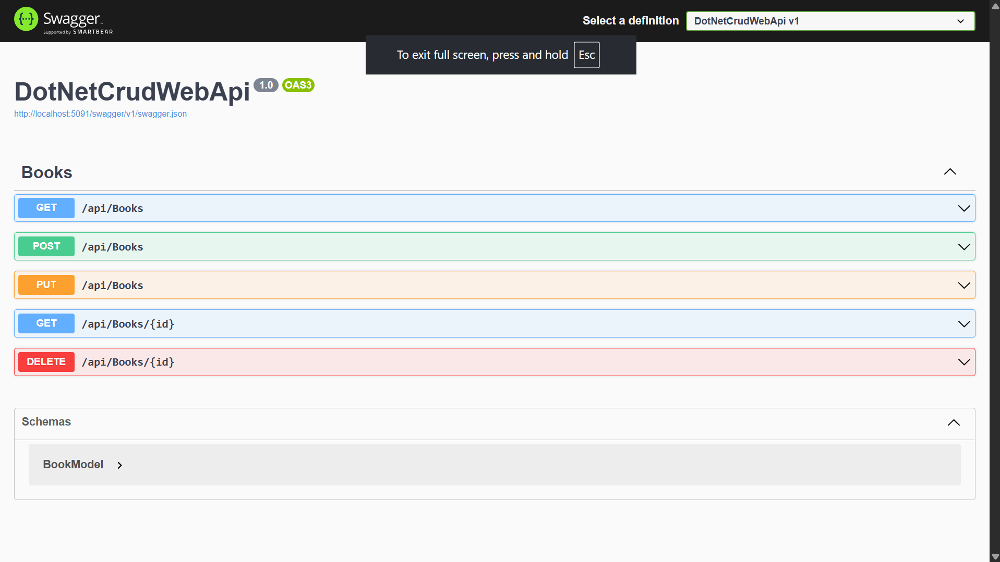

# Book Inventory API

A RESTful Web API for managing a book inventory, built with ASP.NET Core, Entity Framework Core, and SQLite. Supports full CRUD operations (Create, Read, Update, Delete) with Swagger UI for interactive testing.

## Tech Stack
- ASP.NET Core 8.0
- Entity Framework Core (Code-First)
- SQLite
- Swagger / OpenAPI

## Features
- Add, view, update, and delete books
- Each book has: Title, Author, Genre, Published Date, Stock count
- Auto-generated database via EF Core migrations
- Interactive API testing via Swagger UI

## Screenshot


## API Endpoints

| Method | Endpoint          | Description        |
|--------|-------------------|---------------------|
| GET    | /api/Books        | Get all books       |
| GET    | /api/Books/{id}    | Get a book by ID    |
| POST   | /api/Books        | Add a new book       |
| PUT    | /api/Books/{id}    | Update a book         |
| DELETE | /api/Books/{id}    | Delete a book         |

## Getting Started

### Prerequisites
- [.NET 8 SDK](https://dotnet.microsoft.com/download)

### Run locally
```bash
git clone https://github.com/mansisgit/book-inventory-api.git
cd book-inventory-api/DotNetCrudWebApi
dotnet restore
dotnet ef database update
dotnet run
```

Then open `http://localhost:5091/swagger` to test the API.

## Sample Request
```json
POST /api/Books
{
  "title": "Atomic Habits",
  "author": "James Clear",
  "genre": "Self-help",
  "publishedDate": "2018-10-16",
  "stock": 5
}
```

## Author
Mansi Chate
